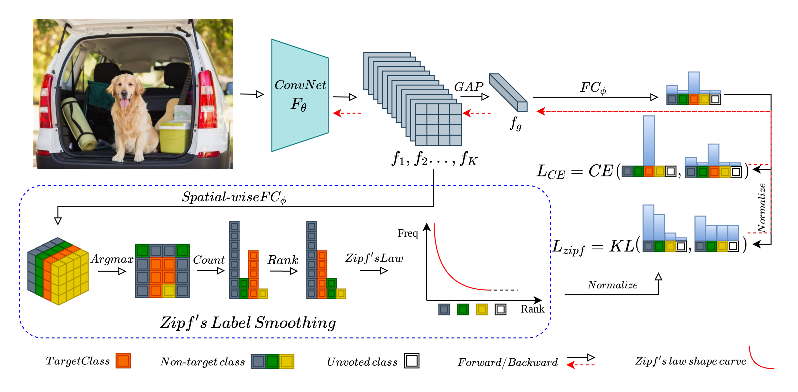
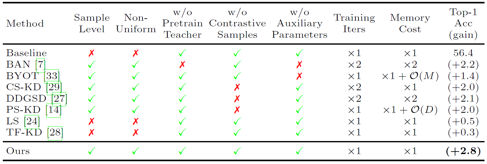

<<<<<<< HEAD
This repo is the official megengine implementation of the ECCV2022 paper: Efficient One Pass Self-distillation with Zipf's Label Smoothing. The pytorch implementation version will be released one month later and we guarantee that performances can be matched with megengine version.

# Zipf's LS: Efficient One Pass Self-distillation with Zipf's Label Smoothing

## Framework & Comparison
<div style="text-align:center"></div>
<div style="text-align:center"></div>

## Main Results
| Method              | DenseNet121   | DenseNet121  | ResNet18   | ResNet18     |
|:--------------------|:--------------|:-------------|:-----------|:-------------|
| **Arch**                | **CIFAR100**      | **TinyImageNet** | **CIFAR100**   | **TinyImageNet** |
| Pytorch Baseline    | 77.86±0.26    | 60.31±0.36   | 75.51±0.28 | 56.41±0.20   |
| **Pytorch Zipf's LS**   | **79.03±0.32**    | **62.64±0.30**   | **77.38±0.32** | **59.25±0.20**   |
| Megengine Baseline  | 77.97±0.18    | 60.78±0.31   | 75.29±0.29 | 56.03±0.34   |
| **Megengine Zipf's LS** | **79.85±0.27**    | **62.35±0.32**   | **77.08±0.28** | **59.01±0.23**   |

## Training
```
### train_baseline_cifar100_resnet18:
python3 train.py --dataset CIFAR100 --data_dir cifar100_data --arch CIFAR_ResNet18 --loss_lambda 0.0 --alpha 0.0 --dense
### train_ZipfsLS_cifar100_resnet18:
python3 train.py --dataset CIFAR100 --data_dir cifar100_data --arch CIFAR_ResNet18 --loss_lambda 0.1 --alpha 0.1 --dense
```
See more examples in [Makefile](Makefile).
# Liscense
Zipf's LS is released under the Apache 2.0 license. See [LICENSE](LICENSE) for details.
=======
# zipfls_eccv2022
>>>>>>> 8f461a38d557fec18c9b371b31bf6e9f8125a559
